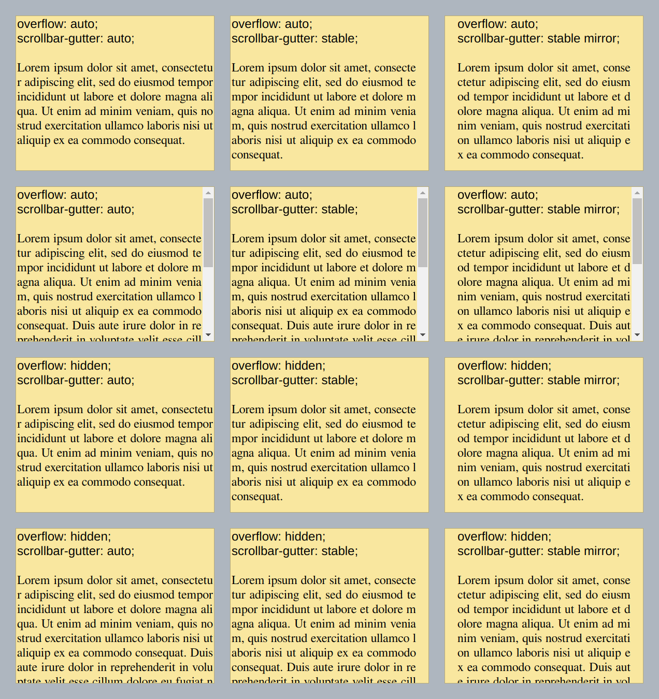
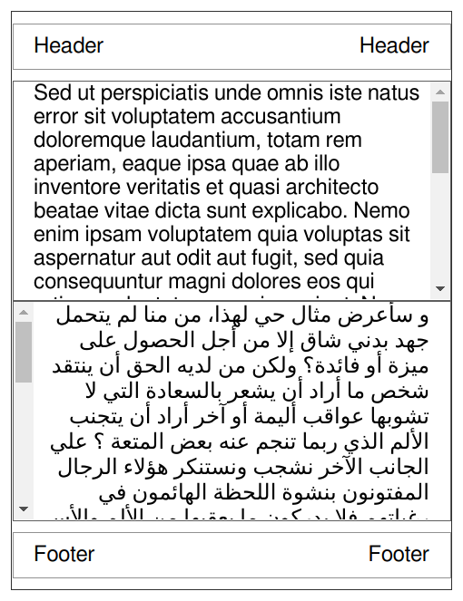
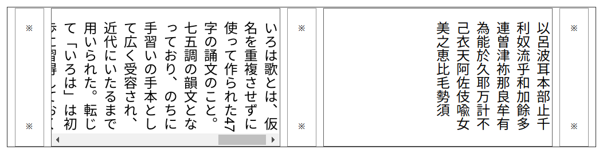
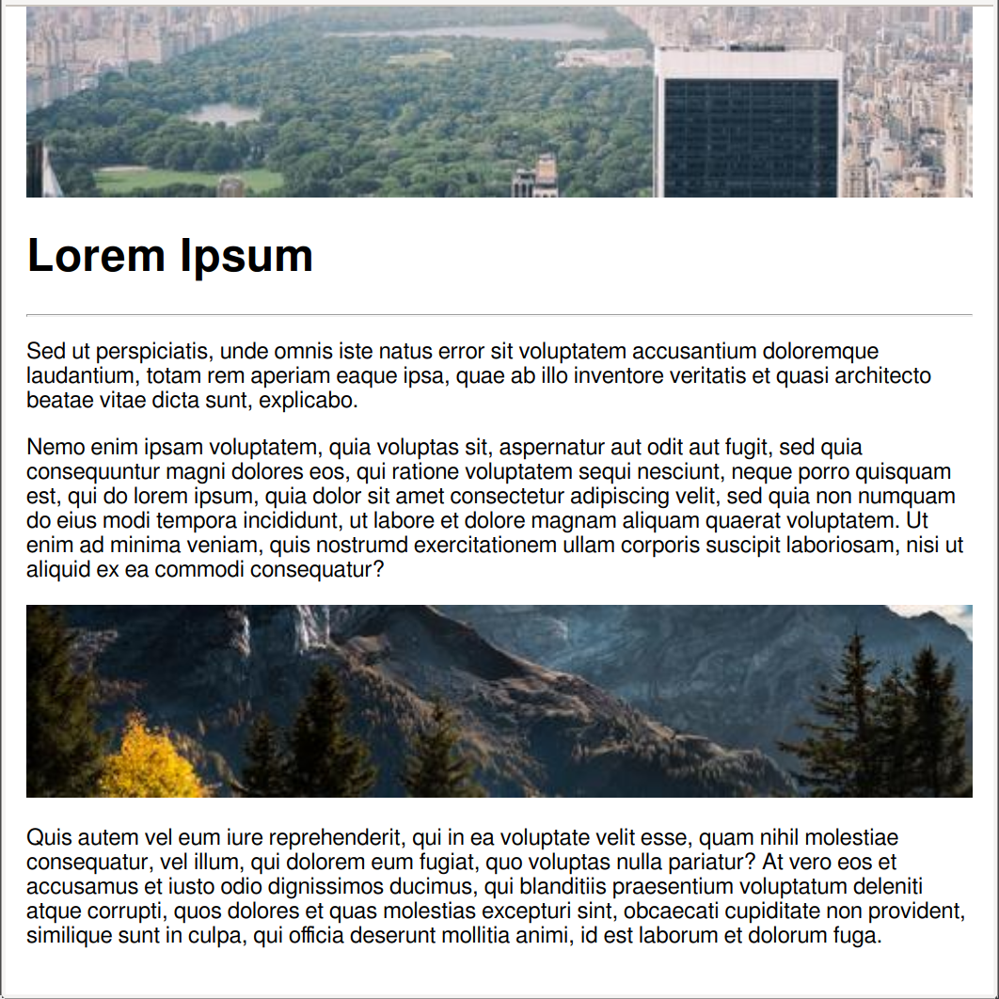
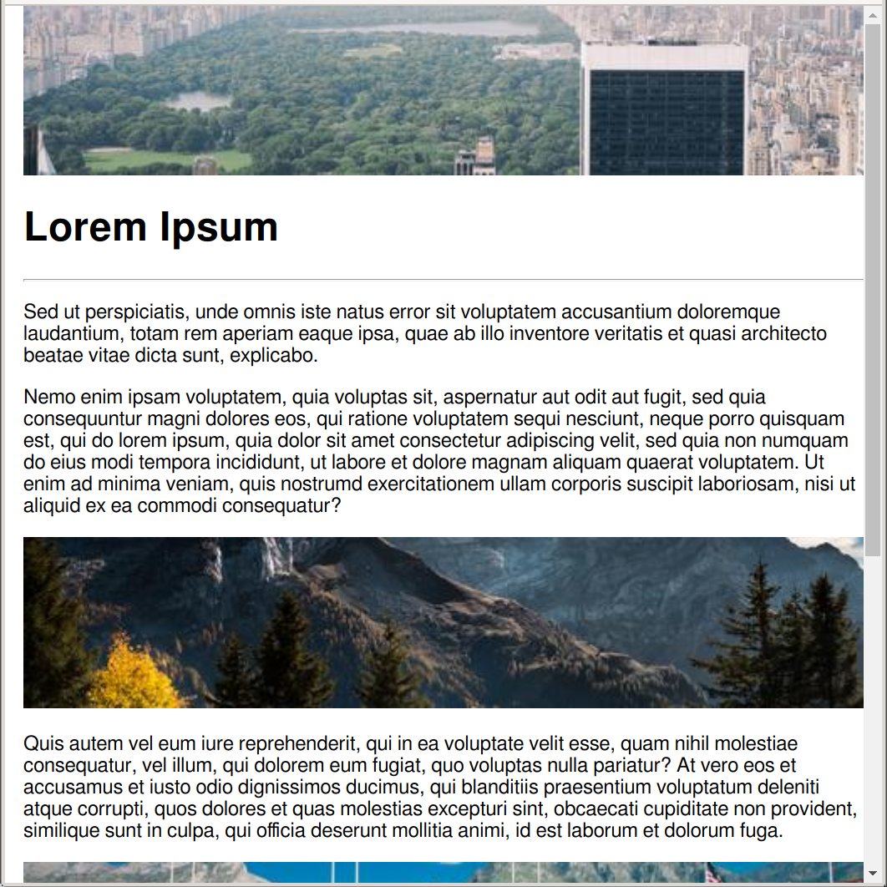

# Explainer: the `scrollbar-gutter` CSS property

- Contents:
  - [Author](#author)
  - [Participate](#participate)
  - [Introduction](#introduction)
  - [Background](#background)
  - [Definition and values](#definition-and-values)
  - [Interaction between `overflow` and `scrollbar-gutter`](#interaction-between-overflow-and-scrollbar-gutter)
  - [Layout](#layout)
  - [Painting](#painting)
  - [Propagation](#propagation)
  - [Illustrations 🌅](#illustrations-)
  - [Examples](#examples)
  - [References](#references)


## Author

* [Felipe Erias](felipeerias)

## Participate

* [Chromium intent-to-prototype](https://groups.google.com/a/chromium.org/d/msg/blink-dev/GErJ9WbxJrU/F8N2xl1kBgAJ)
* [TAG design review](https://github.com/w3ctag/design-reviews/issues/520)
* [Chromium bug #710214](https://bugs.chromium.org/p/chromium/issues/detail?id=710214)

## Introduction

The `scrollbar-gutter` CSS property (defined in [CSS Overflow L4](https://drafts.csswg.org/css-overflow-4/#scrollbar-gutter-property)) provides control over the presence of scrollbar gutters (the space which may be reserved to display a scrollbar).

This gives Web authors more agency over how their layouts interact with the scrollbars provided by the browser, so they can e.g. prevent excessive layout changes as content expands while avoiding unwanted visuals when scrolling isn't needed.

Note that the presence of the scrollbars themselves is determined by the `overflow` property and the decision of whether to use classical or overlay scrollbars is up to the user agent.

## Background

The *scrollbar gutter* is the space between the inner border edge and the outer padding edge, where user agents may display a scrollbar.

*“Classic” scrollbars* are always placed in a gutter, consuming space when present, and are usually opaque.

*“Overlay” scrollbars* are placed over the content, not in a gutter, and are usually partially transparent. Their appearance may vary depending on whether and how the user is interacting with them.

The user agent determines whether classic scrollbars or overlay scrollbars are used. Likewise, the user agent also defines the appearance and size of scrollbars and whether they appear on the start or end edge of the box.

## Definition and values

The syntax for the `scrollbar-gutter` property is:

```
auto | stable && mirror?
```

These values have the following meaning:

* `auto`: No changes from current behaviour. Default value.
* `stable`: When using classic scrollbars, the gutter will be present if `overflow` is `hidden`, `scroll` or `auto` even if the box is not overflowing. When using overlay scrollbars, the gutter will not be present.
  * Use case: Prevent layout changes when the content grows or shrinks.

The `stable` value can be used in combination with:

* `mirror`: If a gutter would be present on one of the inline start/end edges of the box, another must be present on the opposite edge as well.
  * Use case: simmetry between padding on both sides of the box.
  * Use case: keep the layout stable regardless of the edge where the user agent decides to place the scrollbar.

The spec also includes an informative section with current attempts at extending the `scrollbar-gutter` property to cover more use cases: [Appendix A: Possible extensions for scrollbar-gutter](https://drafts.csswg.org/css-overflow-4/#sbg-ext).

## Interaction between `overflow` and `scrollbar-gutter`

These are the contexts when space will be reserved for the scrollbar gutter:

* Using **classic** scrollbars:
  * when `overflow` is `scroll`
  * when `overflow` is `auto` and
    * `scrollbar-gutter` uses `stable` or (when the box is overflowing) `auto` 
  * when `overflow` is `hidden` and
    * `scrollbar-gutter` uses `stable`

## Layout

For classic scrollbars, the width of the gutter is the same as the width of the scrollbar.

## Painting

This property does not influence how the scrollbars themselves are painted.

When the gutter is present but the scrollbar is not, or the scrollbar is transparent or otherwise does not fully obscure the gutter, the background of the gutter must be painted as an extension of the padding.

## Propagation

The `scrollbar-gutter` value set on the root element is propagated to the viewport. See https://github.com/w3c/csswg-drafts/issues/6079 for more details (specifically [this CSSWG discussion and agreements](https://github.com/w3c/csswg-drafts/issues/6079#issuecomment-816307011)).

## Illustrations 🌅

Effect of different values of `scrollbar-gutter` with ***classic*** scrollbars:



## Examples

`scrollbar-gutter` with horizontal text:

* source: [scrollbar_gutter_example_01.html](examples/scrollbar_gutter_example_01.html)


`scrollbar-gutter` with vertical text:

* source: [scrollbar_gutter_example_02.html](examples/scrollbar_gutter_example_02.html)



`scrollbar-gutter` on the root element of the page:

* source: [scrollbar_gutter_example_03.html](examples/scrollbar_gutter_example_03.html)





## References

* Spec: https://drafts.csswg.org/css-overflow-4/#scrollbar-gutter-property
* CSSWG Discussions:
  * https://github.com/w3c/csswg-drafts/issues/92
  * https://github.com/w3c/csswg-drafts/issues/4674#issuecomment-857841639
  * https://github.com/web-platform-tests/wpt/issues/10972#issuecomment-395262455
  
