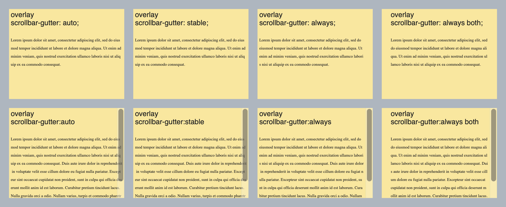

# Explainer: the `scrollbar-gutter` CSS property

- Contents:
  - [Author](#author)
  - [Participate](#participate)
  - [Introduction](#introduction)
  - [Background](#background)
  - [Definition and values](#definition-and-values)
  - [Interaction between `overflow` and `scrollbar-gutter`](#interaction-between-overflow-and-scrollbar-gutter)
  - [Layout](#layout)
  - [Painting](#painting)
  - [Propagation](#propagation)
  - [Illustrations 🌅](#illustrations-)
  - [Examples](#examples)
  - [References](#references)


## Author

* [Felipe Erias](felipeerias)

## Participate

* [Chromium intent-to-prototype](https://groups.google.com/a/chromium.org/d/msg/blink-dev/GErJ9WbxJrU/F8N2xl1kBgAJ)
* [TAG design review](https://github.com/w3ctag/design-reviews/issues/520)
* [Chromium bug #710214](https://bugs.chromium.org/p/chromium/issues/detail?id=710214)

## Introduction

The `scrollbar-gutter` CSS property (defined in [CSS Overflow L4](https://drafts.csswg.org/css-overflow-4/#scrollbar-gutter-property)) provides control over the presence of scrollbar gutters (the space which may be reserved to display a scrollbar).

This gives Web authors more agency over how their layouts interact with the scrollbars provided by the browser, so they can e.g. prevent excessive layout changes as content expands while avoiding unwanted visuals when scrolling isn't needed.

Note that the presence of the scrollbars themselves is determined by the `overflow` property and the decision of whether to use classical or overlay scrollbars is up to the user agent.

## Background

The *scrollbar gutter* is the space between the inner border edge and the outer padding edge, where user agents may display a scrollbar.

*“Classic” scrollbars* are always placed in a gutter, consuming space when present, and are usually opaque.

*“Overlay” scrollbars* are placed over the content, not in a gutter, and are usually partially transparent. Their appearance may vary depending on whether and how the user is interacting with them.

The user agent determines whether classic scrollbars or overlay scrollbars are used. Likewise, the user agent also defines the appearance and size of scrollbars and whether they appear on the start or end edge of the box.

## Definition and values

The syntax for the `scrollbar-gutter` property is:

```
auto | [ stable | always ] && both? && force?
```

These values have the following meaning:

* `auto`: No changes from current behaviour. Default value.
* `stable`: When using classic scrollbars, the gutter will be present if `overflow` is `scroll` or `auto` even if the box is not overflowing. When using overlay scrollbars, the gutter will not be present.
  * Use case: Prevent layout changes when the content grows or shrinks.
* `always`: The scrollbar gutter is always present when `overflow` is `scroll` or `auto`, regardless of the type of scrollbar or of whether the box is overflowing.
  * Use case: fix instances where an overlay scrollbar would obscure content. See https://github.com/w3c/csswg-drafts/issues/4674#issuecomment-577662037
  * Use case: more predictable Web engine layout tests across platforms. See: https://github.com/web-platform-tests/wpt/issues/10972

These can only be used in combination with `stable` and `always`:

* `both`: If a gutter would be present on one of the inline start/end edges of the box, another must be present on the opposite edge as well.
  * Use case: simmetry between padding on both sides of the box.
  * Use case: keep the layout stable regardless of the edge where the user agent decides to place the scrollbar.
* `force`: the keywords `stable` and `always` are also in effect when `overflow` is `visible`, `hidden` or `clip`; only the gutter is displayed, not a scrollbar.
  * Use case: reserve the same amount of space on the edges of an element that is adjacent to a scrolling element as is being reserved in the latter, so that both elements line up visually. See https://github.com/w3c/csswg-drafts/issues/4674#issuecomment-577662037

## Interaction between `overflow` and `scrollbar-gutter`

This list summarizes the cases when space will be reserved for the scrollbar gutter:

* Using **classic** scrollbars:
  * when `overflow` is `scroll`
  * when `overflow` is `auto` and
    * `scrollbar-gutter` uses `stable`, `always`, or (when the box is overflowing) `auto` 
  * when `overflow` is `visible`, `hidden` or `clip`, and
    * `scrollbar-gutter` uses `force` together with `stable` or `always`
* Using **overlay** scrollbars:
  * when `overflow` is `scroll` or `auto` and
    * `scrollbar-gutter` uses `always`
  * when `overflow: ` `visible`, `hidden` or `clip`, and
    * `scrollbar-gutter` uses `force` together with `always`

## Layout

For classic scrollbars, the width of the gutter is the same as the width of the scrollbar.

For overlay scrollbars, the width of the gutter is defined by the user agent, with the following constraints:

* the width must not be 0
* it must not change based on user interactions with the page or the scrollbar (even if the scrollbar itself changes)
* it must be the same for all elements in the page

## Painting

This property does not influence how the scrollbars themselves are painted.

When the gutter is present but the scrollbar is not, or the scrollbar is transparent or otherwise does not fully obscure the gutter, the background of the gutter must be painted as an extension of the padding.

## Propagation

The `scrollbar-gutter` value set on the root element is propagated to the viewport. See https://github.com/w3c/csswg-drafts/issues/6079 for more details (specifically [this CSSWG discussion and agreements](https://github.com/w3c/csswg-drafts/issues/6079#issuecomment-816307011)).

## Illustrations 🌅

Effect of different values of `scrollbar-gutter` with ***classic*** scrollbars (using `overflow: auto;`):


Effect of different values of `scrollbar-gutter` with ***overlay*** scrollbars (using `overflow: auto;`):



## Examples:

The [examples folder](/examples) contains several examples of `scrollbar-gutter` in use.

* [scrollbar_gutter_example_01.html](examples/scrollbar_gutter_example_01.html) uses `stable`, `both` and `force` to display LTR and RTL text.
  * [with fixed scrollbars](examples/images/example01-fixed-scrollbars.png), [with overlay scrollbars](examples/images/example01-overlay-scrollbars.png)
* [scrollbar_gutter_example_02.html](examples/scrollbar_gutter_example_02.html) is similar to the previous but using `always`.
  * [with fixed scrollbars](examples/images/example02-fixed-scrollbars.png), [with overlay scrollbars](examples/images/example02-overlay-scrollbars.png)
* [scrollbar_gutter_example_03.html](examples/scrollbar_gutter_example_03.html) uses `stable`, `both` and `force` to display vertical text.
  * [with fixed scrollbars](examples/images/example03-fixed-scrollbars.png), [with overlay scrollbars](examples/images/example03-overlay-scrollbars.png)
* [scrollbar_gutter_example_04.html](examples/scrollbar_gutter_example_04.html) is similar to the previous but using `always`.
  * [with fixed scrollbars](examples/images/example04-fixed-scrollbars.png), [with overlay scrollbars](examples/images/example04-overlay-scrollbars.png)
* [scrollbar_gutter_example_05.html](examples/scrollbar_gutter_example_05.html) shows a case where `always` is needed to prevent a list with interactive elements from being obscured by overlay scrollbars.
  * [with fixed scrollbars](examples/images/example05-fixed-scrollbars.png), [with overlay scrollbars](examples/images/example05-overlay-scrollbars.png)
* [scrollbar_gutter_example_06.html](examples/scrollbar_gutter_example_06.html) is an interesting scenario: each individual line item in the second list uses `force` to move the interactive element away from the overlay scrollbar while the background extends all the way to the edge of the box, but this results in unnecesary space when the scrollbar is fixed.
  * This is related to ongoing discussions about how to evolve `scrollbar-gutter` and/or other features (e.g. environment variables holding the different scrollbar sizes).
  * [with fixed scrollbars](examples/images/example06-fixed-scrollbars.png), [with overlay scrollbars](examples/images/example06-overlay-scrollbars.png)
* [scrollbar_gutter_example_07.html](examples/scrollbar_gutter_example_07.html) displays a long text with images; the text elements use `scrollbar-gutter: always both force` so they are centered and not covered by any scrollbars, while the images expand from edge to edge.
  * this works best [with overlay scrollbars](examples/images/example07-overlay-scrollbars.png), as there is unwanted space [with fixed scrollbars](examples/images/example07-fixed-scrollbars.png)
* [scrollbar_gutter_example_08.html](examples/scrollbar_gutter_example_08.html) applies `scrollbar-gutter: stable both` to the viewport, to prevent layout changes as the main content grows.
  * [no scrolling](examples/images/example08-fixed-noscrolling.png)
  * [with scrolling](examples/images/example08-fixed-scrolling.png)


## References

* Spec: https://drafts.csswg.org/css-overflow-4/#scrollbar-gutter-property
* CSSWG Discussions:
  * https://github.com/w3c/csswg-drafts/issues/92
  * https://github.com/w3c/csswg-drafts/issues/4674#issuecomment-577662037
  * https://github.com/w3c/csswg-drafts/issues/4674#issuecomment-575027040
  * https://github.com/web-platform-tests/wpt/issues/10972#issuecomment-395262455
  
